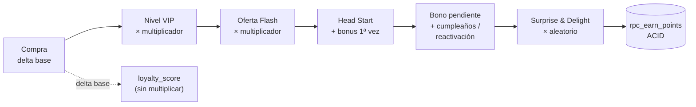
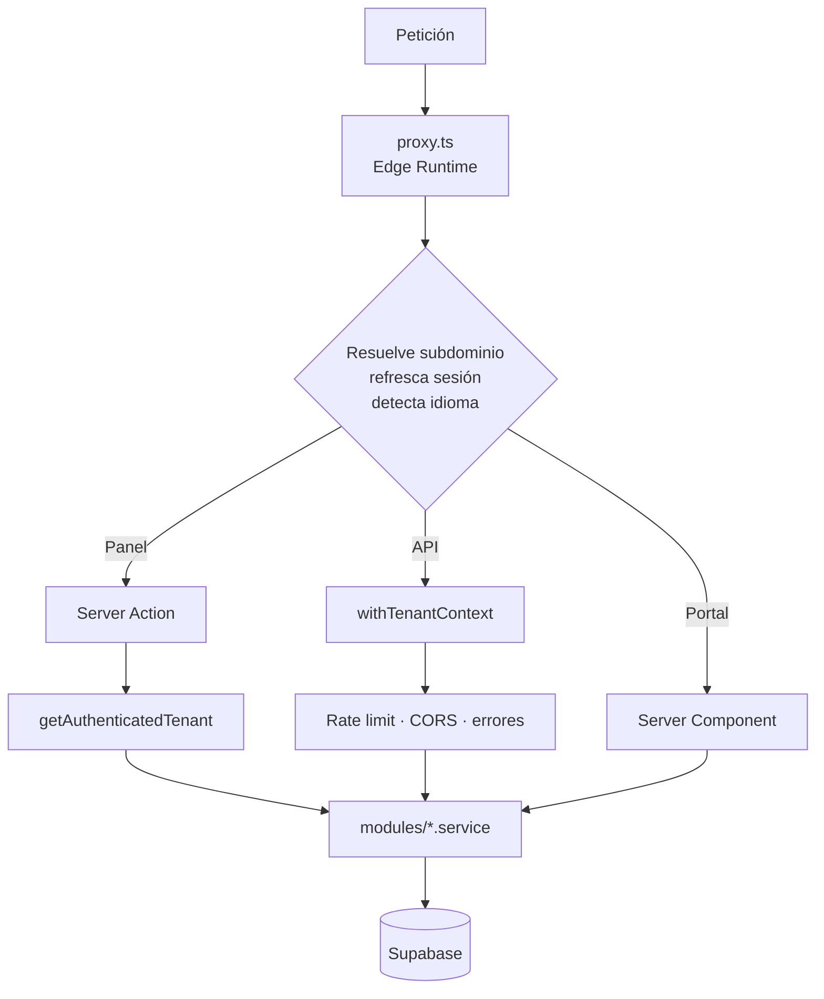
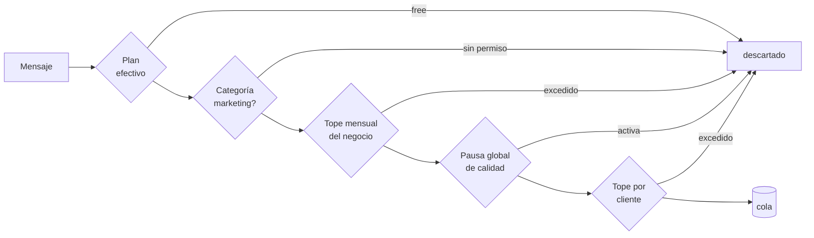

<div align="center">

<picture>
  <source media="(prefers-color-scheme: dark)" srcset="public/logofideliza.svg">
  <source media="(prefers-color-scheme: light)" srcset="public/logofidelizalight.svg">
  
</picture>

**Programas de lealtad para negocios de Latinoamérica.**
SaaS multi-tenant · Un subdominio por negocio · Sin app que descargar

<br>


</div>

---

## Qué es

Fideliza reemplaza la tarjeta de sellos de papel por un sistema que el negocio
administra desde un panel y el cliente consulta desde su teléfono.

Cada negocio es un **tenant** con su propio subdominio (`negocio.fideliza.app`),
su marca, sus programas y sus clientes. El aislamiento es total: un negocio nunca
ve datos de otro, ni siquiera por accidente de configuración.

El cliente final **no crea cuenta, no descarga nada y no pone contraseña.** Entra
con un código de acceso de 10 caracteres y su tarjeta queda recordada en el
dispositivo. Esa decisión es la que sostiene todo lo demás: el mostrador de una
cafetería no puede pedirle a alguien que se registre mientras hay fila.

---

## El modelo de lealtad

### Cuatro tipos de programa

Un negocio puede correr varios a la vez. La **unidad** cambia según el tipo, y
`lib/utils/program-units.ts` es la única fuente de cómo se nombra y se formatea.

| Tipo | Cómo acumula | Unidad |
|---|---|---|
| **Puntos** | `puntos_por_peso × monto de compra` | Puntos |
| **Sellos** | 1 sello por transacción | Sellos |
| **Visitas** | 1 visita por transacción | Visitas |
| **Cashback** | `monto × porcentaje` — 1 unidad = 1 centavo | Saldo `$X.XX` |

### Motor de retención

Sobre esa base corren mecánicas que se activan solas durante una transacción
normal, sin que el cajero tenga que hacer nada distinto:

- **Ofertas Flash** — multiplicador en días y horas específicas ("2× de 2 a 5 pm,
  lunes a viernes"). Visible para el cliente en su portal.
- **Niveles VIP** — un `loyalty_score` global cross-programa que otorga
  multiplicador permanente, premios exclusivos y un cupón de regalo al subir. Con
  ventana de revalidación opcional: el nivel puede caducar si el cliente deja de venir.
- **Surprise & Delight** — multiplicador aleatorio con probabilidad configurable.
- **Artificial Head Start** — la tarjeta no arranca en cero, arranca con avance
  regalado. Solo en el primer earn del programa.
- **Misiones** — objetivos con bonus ("5 visitas este mes").
- **Referidos** — código por cliente; se paga al referidor cuando su invitado
  hace su primera compra, no al registrarse.
- **Bonos de cumpleaños y reactivación** — se emiten como crédito pendiente y se
  acreditan en la siguiente compra, así aplican al programa correcto.
- **Ranking mensual** — podio del negocio y posición del cliente con sus vecinos.

### Cómo se combinan en una transacción

El orden importa y es fijo. El `loyalty_score` que decide el nivel VIP se acumula
con el delta **base**, nunca con el multiplicado — si no, ser VIP aceleraría la
subida al siguiente nivel y el sistema se realimentaría solo.



Las operaciones de puntos **no** son secuencias de llamadas desde JavaScript: son
funciones RPC de PostgreSQL que corren dentro de una sola transacción. Un earn
toca la transacción, la inscripción y el saldo; a medias dejaría a un cliente con
puntos cobrados y sin registro.

---

## Arquitectura

### Stack

| Capa | Tecnología |
|---|---|
| Framework | Next.js 16 (App Router) + React 19 |
| Base de datos | Supabase — PostgreSQL, Auth y RLS |
| Facturación | Stripe (Checkout, Portal, Webhooks) |
| WhatsApp | Twilio con plantillas aprobadas por Meta |
| Email | Resend |
| Rate limiting | Upstash Redis en producción; Map en memoria en dev |
| Deploy | Vercel |
| Estilos | Tailwind CSS |
| Idiomas | Español (default) e Inglés |

### Organización

```
src/
├── app/
│   ├── (auth)/         Registro y recuperación de contraseña
│   ├── (customer)/c/   Portal del cliente — acceso por código
│   ├── (dashboard)/    Panel del negocio — autenticado
│   ├── (marketing)/    Landing, manual, legales
│   ├── admin/          Panel interno de Fideliza
│   └── api/            REST pública + crons + webhooks
├── components/         UI compartida
├── lib/                Configuración, utilidades, middleware, integraciones
├── modules/            Lógica de negocio (repository + service)
└── proxy.ts            Middleware: subdominio, sesión, locale
```

`modules/` concentra las reglas de negocio; `app/` solo orquesta. Las mutaciones
del panel son **server actions**, no endpoints REST — la API pública existe para
integrar puntos de venta externos, no para alimentar la propia interfaz.

### Camino de una petición



### Módulos de fuente única

Un patrón que se repite a propósito: cuando dos partes del sistema tienen que
coincidir, la regla vive en **un solo archivo** que ambas importan.

| Archivo | Qué unifica | Qué evita |
|---|---|---|
| `config/plans.ts` | Límites y features por plan | Que una pantalla permita lo que otra bloquea |
| `utils/program-units.ts` | Nombre y formato de cada unidad | Tres copias que ya divergían |
| `utils/flash-offer.ts` | Ventana de la oferta flash | Que el portal anuncie 2× en una hora donde el earn no lo da |
| `utils/tier-score.ts` | Puntaje que decide el nivel | Que el portal muestre un nivel distinto al que aplica el motor |
| `config/referral-bonuses.ts` | Bonos default por tipo | Que el panel diga "3 visitas" y el portal "100" |
| `config/vouchers.ts` | Vigencia mínima del voucher | Cupones que vencen antes de que salga el recordatorio |

---

## Motor de WhatsApp

Es el canal principal de retención y también el único costo variable relevante,
así que está construido alrededor de contenerlo.

**Nada se envía en el momento.** Las funciones de envío encolan en
`whatsapp_message_queue` y un cron despacha cada 5 minutos. Un pico de
transacciones no se convierte en un pico de llamadas a Twilio.

Antes de encolar, cinco compuertas en orden:



El **plan efectivo** es el detalle importante: una suscripción vencida o
cancelada deja de enviar aunque la columna `plan` siga diciendo "pro". Leer el
plan crudo mantenía cuentas impagas gastando presupuesto de Twilio.

**13 plantillas activas** cubren bienvenida, vencimiento de cupón, recordatorio
de saldo, cruce del 80% hacia una recompensa, subida y caducidad de nivel VIP,
misión completada, referidos, reactivación, cumpleaños y sorpresa.

Otras **2 están construidas pero apagadas** por bandera de código, no por plan
—`FEATURES.streakAtRisk` y `FEATURES.promotionBlast`— porque enviarlas hoy
significaría mandar un dato falso o un mensaje sin contenido útil. La bandera se
consulta en la interfaz *y* en el punto de entrada, así que una página vieja
tampoco las dispara.

---

## Planes

| | Free | Starter | Pro |
|---|:---:|:---:|:---:|
| Clientes | 50 | ∞ | ∞ |
| Programas | 1 | 3 | ∞ |
| Tipos | puntos, sellos | + visitas | + cashback |
| Portal del cliente | marca Fideliza | marca propia | marca propia |
| WhatsApp / mes | — | 500 | 3 000 |
| WhatsApp marketing | — | — | ✓ |
| Ofertas Flash · Head Start | — | ✓ | ✓ |
| Niveles VIP · Referidos · Misiones | — | — | ✓ |
| Cumpleaños · Surprise & Delight | — | — | ✓ |
| Analytics · Export | — | — | ✓ |

Starter tiene **clientes ilimitados** a propósito: guardar filas no cuesta nada y
el costo real ya está acotado por el tope de WhatsApp. Limitar el conteo solo
perdía ventas. Starter y Pro se separan por funciones de retención, no por
cuántas personas caben.

Las páginas exclusivas de Pro **nunca redirigen**: muestran la pantalla real
difuminada detrás de la invitación a mejorar de plan. Se ve lo que se está
comprando. La seguridad vive en las server actions, que validan del lado del
servidor.

---

## Seguridad y aislamiento

- **RLS activo en todas las tablas.** Las rutas autenticadas usan cliente de
  servicio *después* de resolver el tenant desde el token de sesión.
- **Rate limiting por tenant e IP**, con límites distintos por operación:
  registro, lookup de código, recuperación de contraseña, checkout, exports.
- **CORS restringido** a `*.fideliza.app`.
- **Crons fail-closed** — sin el secreto en el entorno devuelven 401 siempre.
- **Cookie de portal sin atributo `Domain`** — el navegador la confina al host
  exacto, así un negocio no puede leer la tarjeta guardada de otro.
- **Datos privados nunca salen al portal.** Correo, teléfono y notas del cliente
  se quedan en el panel del negocio.
- **Guardia de claves de prueba** — la aplicación aborta si detecta una clave
  `sk_test_` de Stripe en producción.

---

## Decisiones que vale la pena conocer

**Efectos diferidos con `after()`, nunca con promesas sueltas.** En serverless,
devolver la respuesta es la señal para congelar el contenedor: lo que quedó
pendiente en el event loop puede no reanudarse jamás. Las notificaciones de un
mismo earn se encolan en orden fijo para que su llegada no dependa de qué
consulta responda primero.

**El nivel VIP puede caducar sin que exista un paso de degradación.** Con ventana
de revalidación activa, el puntaje se calcula sobre las transacciones de los
últimos N meses; al envejecer, el nivel baja solo. Un periodo de gracia impide
que alguien caiga antes de que exista una ventana completa de datos, y si el
cálculo falla, el sistema recurre al histórico: **un error técnico nunca degrada
a nadie**.

**Los regalos de nivel no salen del catálogo.** Un premio pertenece a un
programa, mientras que el nivel es global — mezclarlos gastaría un espacio del
plan y confundiría inventario de venta con obsequios.

**El código de referido no es el código de acceso.** Se comparte uno y se
resguarda el otro; confundirlos habría entregado la credencial del cliente en
cada invitación.

---

## Documentación interna

| Documento | Contenido |
|---|---|
| [`docs/context.md`](docs/context.md) | Referencia técnica completa del sistema |
| [`docs/whatsapp-templates.md`](docs/whatsapp-templates.md) | Mapa de plantillas, disparadores y topes |
| [`docs/memory/whatsapp-templates.md`](docs/memory/whatsapp-templates.md) | Texto de cada plantilla para dar de alta en Twilio |
| [`docs/testing-guide.md`](docs/testing-guide.md) | Guía de pruebas por plan |
| [`docs/fideliza-guia-comercial.md`](docs/fideliza-guia-comercial.md) | Material comercial |
| [`docs/supabase-auth.md`](docs/supabase-auth.md) | Configuración de autenticación |

---

## Licencia

**Software propietario. Todos los derechos reservados.** © 2026 HAMCSoft.

Este repositorio es visible con fines de portafolio, auditoría y transparencia.
**La visibilidad del código no concede permiso de uso.** No se otorga licencia
para usar, copiar, modificar, distribuir ni desplegar el Software, ni para
emplearlo como material de entrenamiento de modelos de IA.

Se permite únicamente leerlo para evaluación profesional o revisión de
seguridad. Los términos completos están en [`LICENSE`](LICENSE); las
bibliotecas de terceros conservan sus propias licencias.

Para solicitar una licencia de uso, contactar a HAMCSoft.

---

<div align="center">


**Fideliza** — HAMCSoft

</div>
